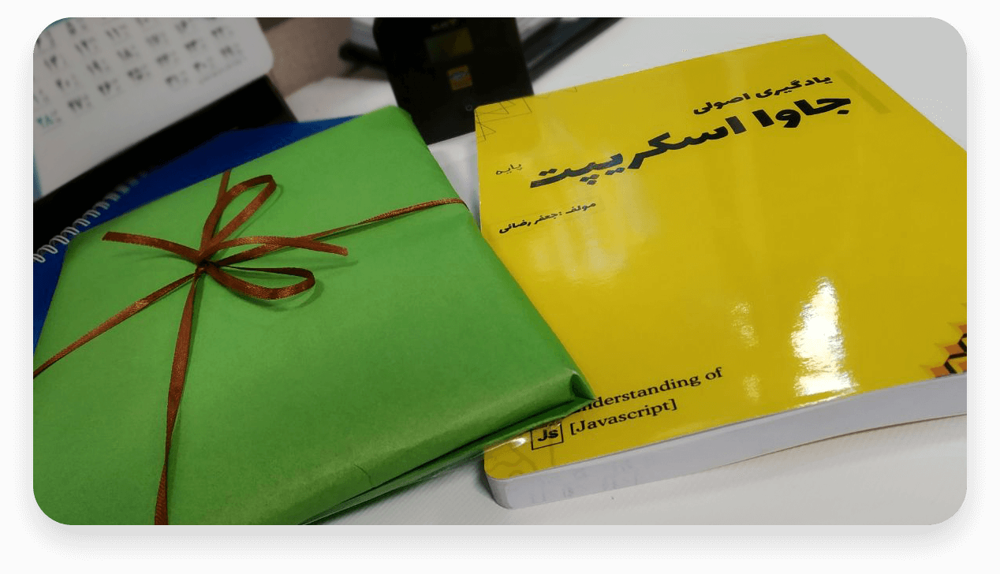

    

### Getting started

This book is made in `254 pages` to teach fundamentals about `JavaScript` language with a focus on summary and brief. I tried to teach everything which could help the reader to learn fast and complete. This book currently available just in the `Persian` language, but I have a plan to translate it into English and help other people to study it.

### How to use it?

We provide a lot of ways to use Better Understanding of JS books, such as [PDF version](https://raw.githubusercontent.com/Mariotek/BetterUnderstandingOfJavascript/master/PDF/project.pdf), [online HTML](http://book.sayjeyhi.com/HTML/?page=1), images, etc. There is a QR code beside every code in the book, and you can see a working code snippet with that QR code.

### About the author

This book is made by JafarRezaei([SayJeyHi](https://twitter.com/Sayjeyhi)), I read some JS books like YDNJS or eloquent JS, and they are really good. But I just want to make a Persian resource to my people who sanctions and other laws do not let them learn free and use open source.

Feel free to contact me at [sayjeyhi@gmail.com](mailto:sayjeyhi@gmail.com), I will be glad to see your feedback.

### Print version

🛍 If you like the book or want to use the physical one, [buy it](https://zarinp.al/242088) from [the Mariotek platform](http://mariotek.ir).

