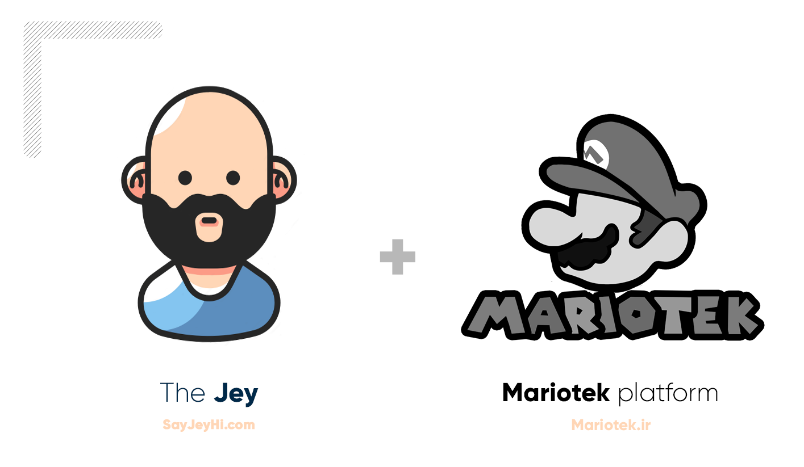

    

[Download PDF version](https://raw.githubusercontent.com/Mariotek/BetterUnderstandingOfJavascript/master/PDF/project.pdf) -
[Study online](https://mariotek.github.io/BetterUnderstandingOfJavascript/HTML/?page=1)

### Getting started

This book is made in `254 pages` to teach funamentals about `javascript` language with focus on summery and breif. I tried to teach everything which could help reader to learn fast and complete. This book currently available just in `persian` language, but I have a plan to translate it to enligh and help other people to study it.

### How to use?

We provide a lot of ways to use `Better Understaning of JS book`, such as [PDF version](https://raw.githubusercontent.com/Mariotek/BetterUnderstandingOfJavascript/master/PDF/project.pdf), [online HTML](https://mariotek.github.io/BetterUnderstandingOfJavascript/HTML/?page=1), images, and blo blo. There is a Qrcode beside of every code in the book, and you can see a working code snippet with that QR code.

### About the author

This book is made by JafarRezaei([SayJeyHi](https://twitter.com/Sayjeyhi)), I read some js books like YDNJS or eloquent js, and they are really good. But I just want make a persian resource to my people who sanctions and other laws do not let them to learn free and use open source.

feel free to contact me at : [sayjeyhi@gmail.com](mailto:sayjeyhi@gmail.com), I will be glad to see your feedbacks.

### Donate !

🛍 If you like the book, or want to use the phisical one, use mariotek site to [buy it](https://zarinp.al/242088) from mariotek platform.

    

